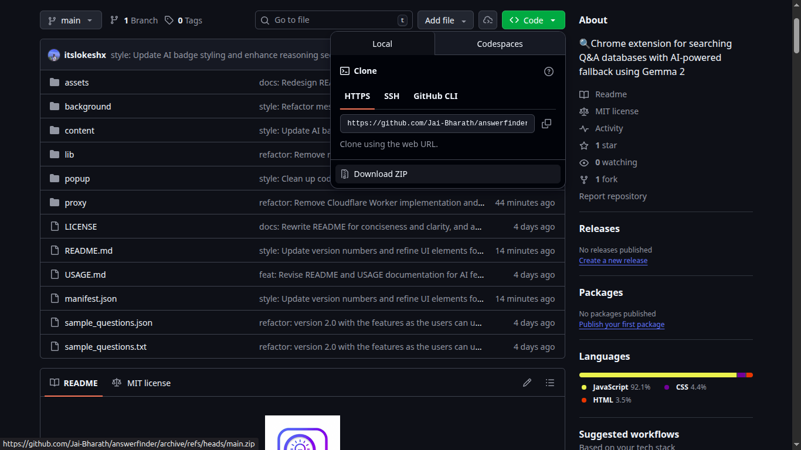
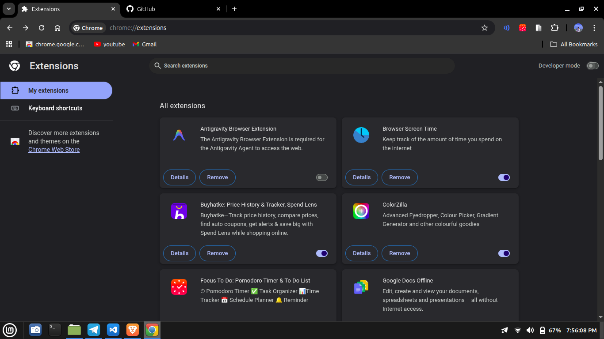
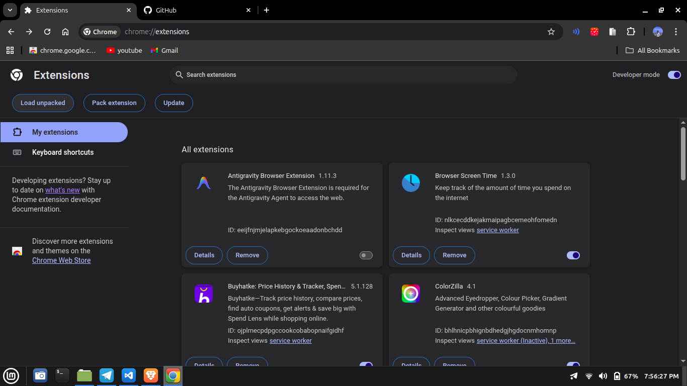
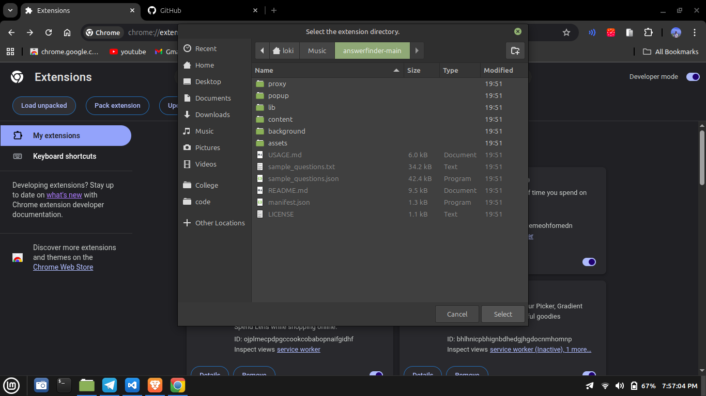
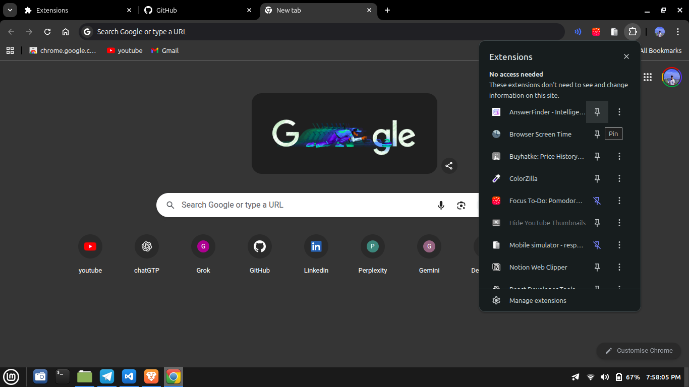
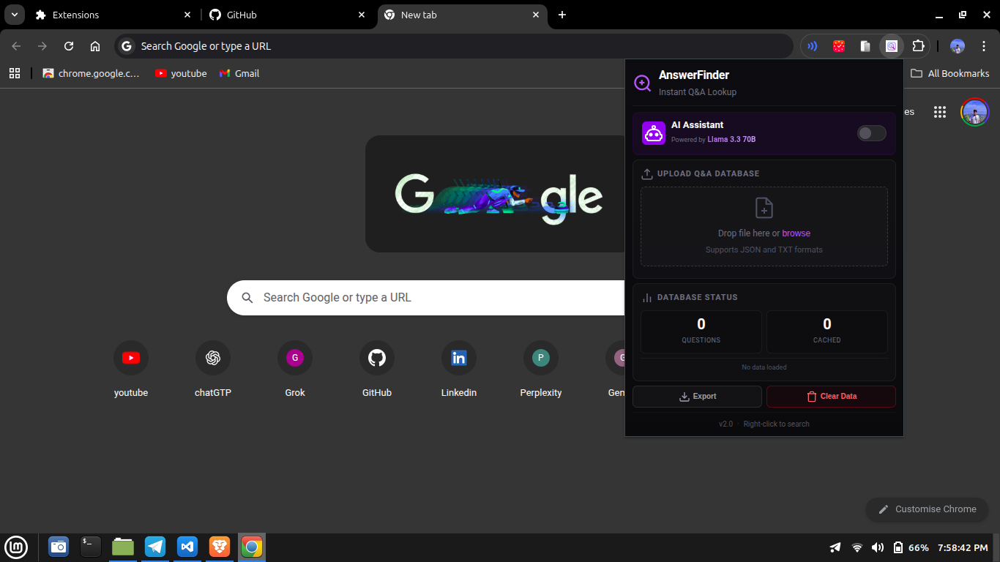
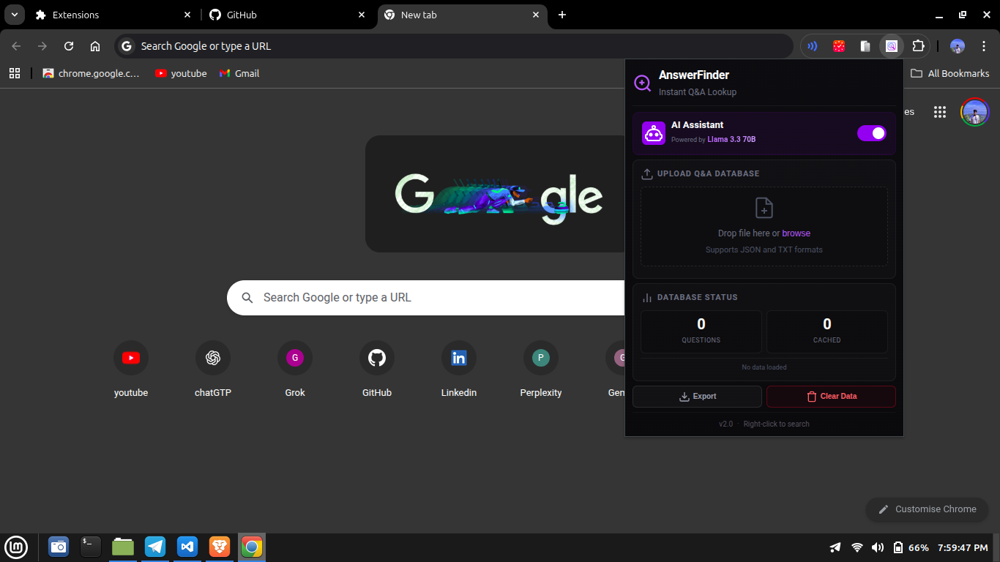
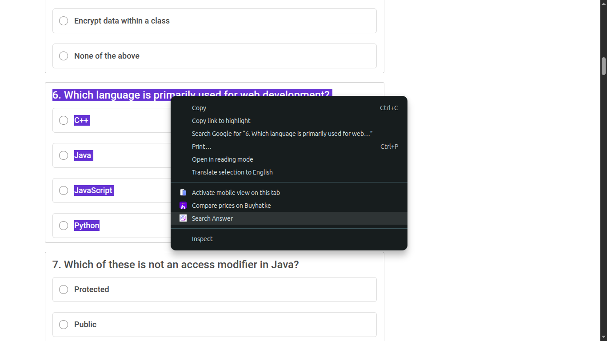
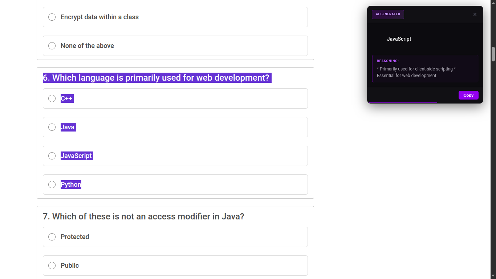

<div align="center">


# AnswerFinder

**Supercharge your browsing: Instantly search your own Q&A database on any webpage—with blazing-fast AI fallback powered by Llama 3.3 70B for answers when you need them most.**

[](manifest.json)
[](https://developer.chrome.com/docs/extensions/)
[](https://groq.com)

</div>

---

## What is AnswerFinder?

A Chrome extension that helps you find answers quickly:

- 📚 **Upload your own Q&A** — Import your questions and answers
- 🔍 **Search anywhere** — Select text on any webpage, right-click to search
- 🤖 **AI backup** — If no match found, AI generates the answer

---

## 📖 Setup Guide (Step by Step)

### Step 1: Download the Extension

Go to the GitHub page and click **Code** → **Download ZIP**



After downloading, **extract/unzip** the folder to a location you'll remember.

---

### Step 2: Open Chrome Extensions Page

Open Chrome and type this in the address bar:

```
chrome://extensions
```

Then press **Enter**.

Make sure **Developer mode** is turned **ON** (toggle in top-right corner).



---

### Step 3: Load the Extension

Click the **"Load unpacked"** button.



---

### Step 4: Select the Folder

Navigate to where you extracted the ZIP file and select the **answerfinder** folder.



---

### Step 5: Pin the Extension

Click the **puzzle icon** 🧩 in Chrome's toolbar, then click the **pin icon** 📌 next to AnswerFinder.

Now you can easily access it anytime!



---

## 🚀 How to Use

### Option A: Upload Your Own Answers

Click the AnswerFinder icon and upload your Q&A file (JSON or TXT format).



<details>
<summary>📝 How to create a Q&A file (click to expand)</summary>

**Simple TXT format:**

```
What is the capital of France?
Paris

Who invented the telephone?
Alexander Graham Bell
```

> Leave a blank line between each question-answer pair

**JSON format (for larger databases):**

```json
[
  { "question": "What is the capital of France?", "answer": "Paris" },
  {
    "question": "Who invented the telephone?",
    "answer": "Alexander Graham Bell"
  }
]
```

</details>

---

### Option B: Enable AI Answers

Don't have a Q&A file? No problem! Turn on **AI Answering** and it will generate answers automatically.



---

### Step 6: Search for Answers

1. Go to any webpage with questions
2. **Select/highlight** the question text with your mouse
3. **Right-click** and choose **"Search Answer"**



---

### Step 7: View Your Answer

The answer appears in a popup on the right side of the screen!



---

## ✨ Features

| Feature               | Description                                   |
| --------------------- | --------------------------------------------- |
| 🎯 **Smart Matching** | Finds answers even with typos or partial text |
| 🤖 **AI Powered**     | Llama 3.3 70B generates answers when needed   |
| 💾 **Local Storage**  | Your data stays on your device                |
| 🔒 **Privacy First**  | No tracking, no analytics                     |
| ⚡ **Super Fast**     | Results in milliseconds                       |

---

## ❓ FAQ

**Q: Is it free?**  
A: Yes, completely free and open source.

**Q: Does it work offline?**  
A: Yes for your uploaded Q&A. AI features need internet.

**Q: Is my data safe?**  
A: Yes, all data stays in your browser. Nothing is sent to servers (except AI queries which are anonymous).

**Q: What browsers are supported?**  
A: Chrome and Chromium-based browsers (Edge, Brave, etc.)

---

## 🆘 Need Help?

Having issues? Try these:

1. **Reload the extension** — Go to `chrome://extensions` and click the refresh icon
2. **Check your Q&A file format** — Make sure it follows the format above
3. **Clear extension data** — Click "Clear Data" in the extension popup

---

<div align="center">

Made with 💜 by the AnswerFinder Team

**[⬆ Back to Top](#answerfinder)**

</div>
